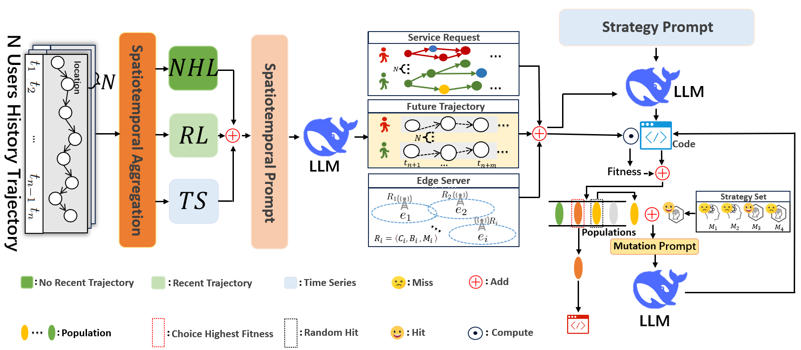
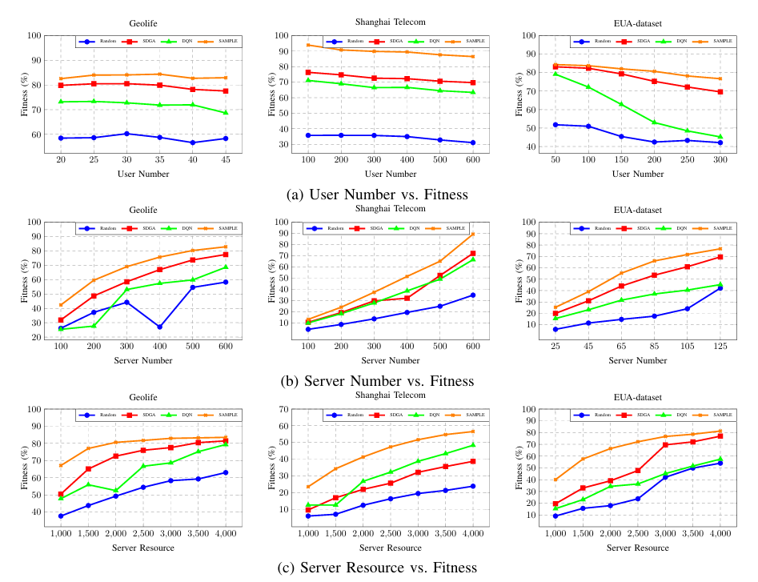

# SAMPLE
## Abstract
The quality of edge computing services is significantly influenced by their ability to perceive the spatiotemporal dynamics of user locations. Traditional approaches to microservice deployment in edge environments often rely on
manual adjustments based on user position and base station load, which introduces substantial complexity and inefficiency. To address these challenges, we propose a novel methodology
for spatiotemporal-aware microservice pre-deployment utilizing large models (SAMPLE). By leveraging the predictive capabilities of spatiotemporal large models, our approach enhances
the microservice’s spatiotemporal awareness through trajectory forecasting. Additionally, we introduce an automated framework
for generating optimal microservice deployment strategies based on the spatiotemporal relationships between users and services.
Experimental results demonstrate that the proposed method significantly improves service quality by autonomously sensing
user movement and dynamically adjusting deployment strategies, enhancing both the efficiency and responsiveness of edge
services. The implementation code and datasets are available at https://anonymous.4open.science/r/SAMPLE.


## Results



## Requirements

    pip install -r requirements.txt

## Usage
We take the Geolife dataset for example.
- Preprocess using the MHSA paper method:


     We preprocess the original dataset using the method described in the MHSA paper. 
     For more details, you can refer to the following repository.

- trajectory prediction:  

  ```bash
  python "Spatial-temporal Perception Module.py"
  ```
- Allocate service chains for each user:

  ```bash
  python "Service chains allocation.py"
- Simulate edge servers based on the predicted location information:

  ```bash
  python "Simulated BaseStation.py"
- Integrate user requests data, edge servers data, and microservice resource consumption data to generate pre-deployment data:

   ```bash
  python "Data merging.py"
- Generate pre-deployment strategies:

   ```bash
   python main.py

## ACKNOWNLEDGES
The implementations of TiSASREec, STAN, and MHSA are based on the following GitHub Repositories. And the link to the original data can also be obtained from the link below.Thank for the works.
<span id="citation-1"></span>
- TiSASRec: https://github.com/JiachengLi1995/TiSASRec
- STAN: https://github.com/yingtaoluo/Spatial-Temporal-Attention-Network-for-POI-Recommendation
- MHSA: https://github.com/mie-lab/location-prediction
- Geolife: https://www.microsoft.com/en-us/download/details.aspx?id=52367
- Shanghai Telecom: https://www.kaggle.com/datasets/mexwell/telecom-shanghai-dataset
- EUA-dataset: https://github.com/PhuLai/eua-dataset 
